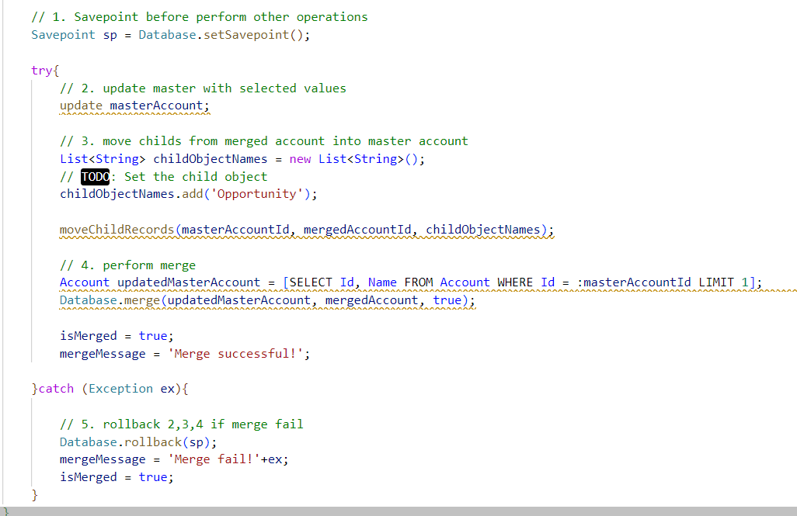
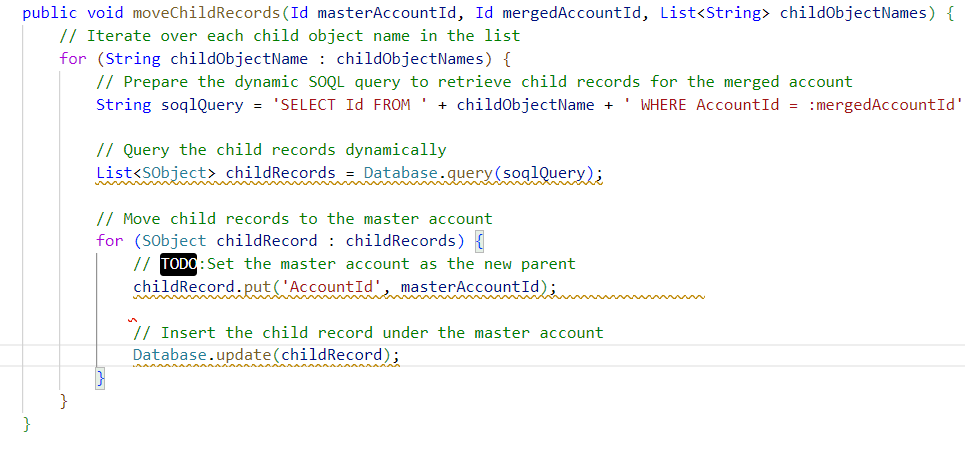
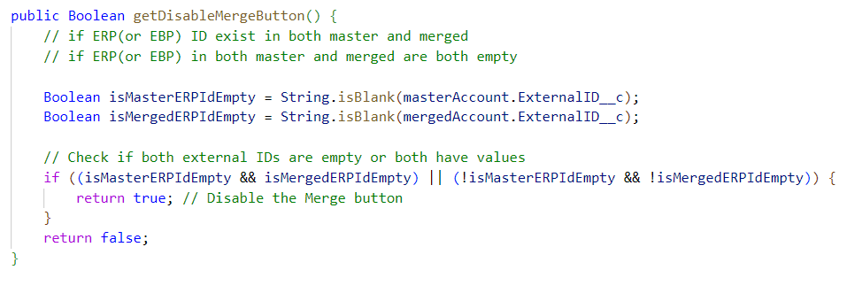

# Purpose of the Project: 

The functionality is similar to the standard salesfoce merge function.
This project provids the following functionality.
- UI to allow two manual input for the account IDs
- Display all fieds which have differnt values between the two accouts for the selection
- After clicking the merge
    - all childs will move to the master account 
    - the selected values will be update to the maser account
    - the merged account will be removed
    - if any DML exception happend, the records will rollback
- Please note that all Date, DateTime and not editable fields are not displaied
- Please modify all *TODOs before using this function

## VF pages

- force-app/main/default/pages/mergeEntry.page
- force-app/main/default/pages/merge.page

## Apex classes

- force-app/main/default/classes/AccountMergeEntryController.cls
- force-app/main/default/classes/AccountMergeController.cls

### Child Object Customization

Modify the code under force-app/main/default/classes/AccountMergeController.cls

- specify which child object you want to move, the code is inside mergeAccounts()
    ```java
    public void moveChildRecords(Id masterAccountId, Id mergedAccountId, List<String> childObjectNames) {
            // Iterate over each child object name in the list
            for (String childObjectName : childObjectNames) {
                // Prepare the dynamic SOQL query to retrieve child records for the merged account
                String soqlQuery = 'SELECT Id FROM ' + childObjectName + ' WHERE AccountId = :mergedAccountId';
                
                // Query the child records dynamically
                List<SObject> childRecords = Database.query(soqlQuery);
                
                // Move child records to the master account
                for (SObject childRecord : childRecords) {
                    // TODO:Set the master account as the new parent
                    childRecord.put('AccountId', masterAccountId);                
                    
                    // Insert the child record under the master account
                    Database.update(childRecord);
                }
            }
        }   
    ```



- specify the exernal ID inside moveChildRecords()




### Disable Merge Conditon Customization

Modify the code under force-app/main/default/classes/AccountMergeController.cls

- set exterinal field inside getDisableMergeButton()



