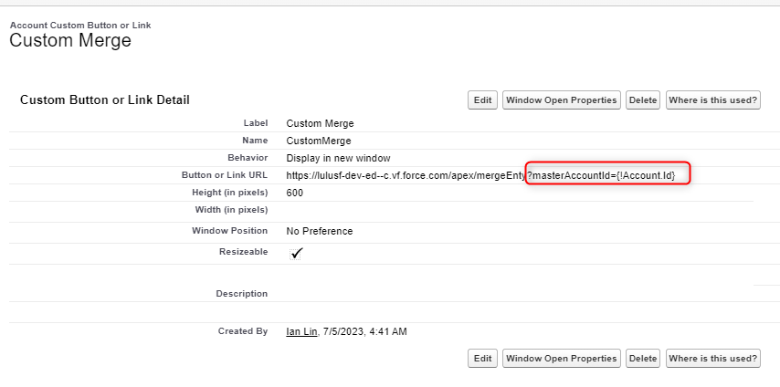

## Custom Merge Function - README
The custom merge function is designed to provide a similar functionality to the standard Salesforce merge function. It allows for merging two account records while preserving selected values and handling child records appropriately. Before using this function, please make sure to modify all the *TODOs according to your specific requirements.

## Functionality Description
The custom merge function offers the following functionality:

1. User Interface (UI):
 - The UI provides two manual input fields for entering the account IDs to be merged.
2. Displaying Different Field Values:
 - The function displays all fields that have different values between the two accounts for user selection.
 - Fields such as Date, DateTime, and non-editable fields are excluded from the selection.
3. Merging Process:
 - After clicking the merge button, the following actions are performed:
 - All child records associated with the merging accounts are moved to the master account.
 - The selected field values are *updated in the master account.
 - The merged account is removed from the system.
 - In case of any DML (Data Manipulation Language) exceptions, the records are rolled back to their original state.
4. Field Update Considerations:
 - It's important to note that the *update operation might fail for certain fields defined with unique constraints and additional special rules. Additional implementation might be needed in such use case.

## VF Pages

- force-app/main/default/pages/mergeEntry.page
- force-app/main/default/pages/merge.page

### To link the VF pages to a detail page, follow these steps:

1. Go to the Account Object Manager.
2. Navigate to the "Buttons, Links, and Actions" section.
3. Either create a new button or edit an existing one.
4. Add the following as a URL parameter: masterAccountId={!Account.Id}.

    


## Apex classes

- force-app/main/default/classes/AccountMergeEntryController.cls
- force-app/main/default/classes/AccountMergeController.cls

### Child Object Customization

To specify which child objects you want to move, modify the code inside mergeAccounts() in force-app/main/default/classes/AccountMergeController.cls.

    ```java
    // 3. move childs from merged account into master account            
            List<String> childObjectNames = new List<String>();
            // TODO: Set the child objects
            childObjectNames.add('Opportunity');
    ```

To specify the external ID, make the following changes:

    ```java
    public void moveChildRecords(Id masterAccountId, Id mergedAccountId, List<String> childObjectNames) {
        // Iterate over each child object name in the list
        for (String childObjectName : childObjectNames) {
            // Prepare the dynamic SOQL query to retrieve child records for the merged account
            String soqlQuery = 'SELECT Id FROM ' + childObjectName + ' WHERE AccountId = :mergedAccountId';
            
            // Query the child records dynamically
            List<SObject> childRecords = Database.query(soqlQuery);
            
            // Move child records to the master account
            for (SObject childRecord : childRecords) {
                // TODO:Set the master account as the new parent
                childRecord.put('AccountId', masterAccountId);                
                
                // Insert the child record under the master account
                Database.update(childRecord);
            }
        }
    } 
    ```


### Disable Merge Conditon Customization

To customize the code inside getDisableMergeButton() in force-app/main/default/classes/AccountMergeController.cls for disabling the merge button, set the external field.

    ```java
    public Boolean getDisableMergeButton() {         
        // if ERP(or EBP) ID exist in both master and merged         
        // if ERP(or EBP) in both master and merged are both empty
        // TODO: Set actual extrnalID custom fields
        
        Boolean isMasterERPIdEmpty = String.isBlank(masterAccount.ExternalID__c);
        Boolean isMergedERPIdEmpty = String.isBlank(mergedAccount.ExternalID__c);

        // Check if both external IDs are empty or both have values
        if ((isMasterERPIdEmpty && isMergedERPIdEmpty) || (!isMasterERPIdEmpty && !isMergedERPIdEmpty)) {
            return true; // Disable the Merge button
        }
        return false;
    }
    ```
Please update the code according to your specific external ID field requirements.

