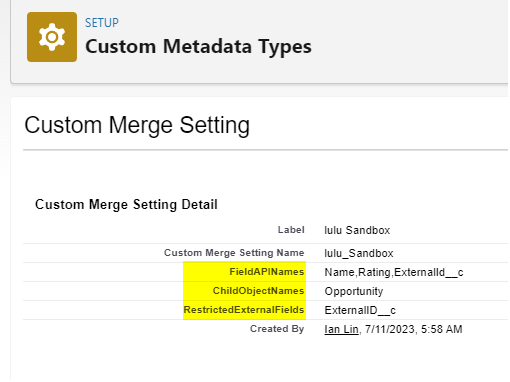
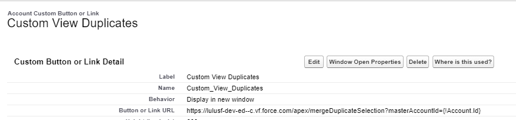
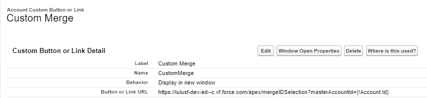
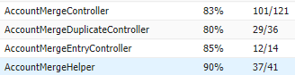

## Custom Merge Function - README
The custom merge function is designed to provide a similar functionality to the standard Salesforce merge function. It allows for merging two account records while preserving selected values and handling child records appropriately. Before using this function, please make sure to define the 'Custom Merge Setting' Custom Metadata Type and modify the *TODOs(which are specified in the code) according to your specific org requirements.

## Functionality Description
The custom merge function offers the following functionality:

1. Two different entry points:
 - Free ID input
 - Select an Account from a Duplication List
2. Different field values selection:
 - The function displays all fields that have different values between the two accounts for merge selection.
 - Fields such as Date, DateTime, and non-editable fields are excluded from the selection.
3. Merging Process:
   After clicking the merge button, the following actions are performed:
 - All child records associated with the merging accounts are moved to the master account.
 - The selected field values are *updated in the master account.
 - The merged account is removed from the system.
 - In case of any DML (Data Manipulation Language) exceptions, the records are rolled back to their original state.
4. Field Update Considerations:
 - It's important to note that the *update operation might fail for certain fields defined with unique constraints or with special rules. Additional implementation is needed in such use case.

## Deployment & Configuration
- All necessary components are defined in package.xml. 
- In VS code, right click on manifest/package.xml and select 'SFDX: Deploy Source in Manifest to Org'

## Custom Metadata Type
1. Create 'Custom Merge Setting' by deploying via package.xml
     ```java
    <types>
            <members>Custom_Merge_Settings__mdt</members>
            <name>CustomObject</name>
    </types>
    ```
2. Create a record for your environment and config the necessary fields


## Implementation Details
### VF Pages

- force-app/main/default/pages/mergeDuplicateSelection.page
- force-app/main/default/pages/mergeIDSelection.page
- force-app/main/default/pages/merge.page

#### To link the VF pages to a detail page, follow these steps:

1. Go to the Account Object Manager.
2. Navigate to the "Buttons, Links, and Actions" section.
3. Add the following as a URL parameter: masterAccountId={!Account.Id}.



### Major Apex classes

- force-app/main/default/classes/AccountMergeDuplicateController.cls
- force-app/main/default/classes/AccountMergeEntryController.cls
- force-app/main/default/classes/AccountMergeController.cls

#### Specify foreign key 

To specify the external ID, make the following changes:

    ```java
    public void moveChildRecords(Id masterAccountId, Id mergedAccountId, List<String> childObjectNames) {
        // Iterate over each child object name in the list
        for (String childObjectName : childObjectNames) {
            // Prepare the dynamic SOQL query to retrieve child records for the merged account
            String soqlQuery = 'SELECT Id FROM ' + childObjectName + ' WHERE AccountId = :mergedAccountId';
            
            // Query the child records dynamically
            List<SObject> childRecords = Database.query(soqlQuery);
            
            // Move child records to the master account
            for (SObject childRecord : childRecords) {
                // TODO:Set the master account as the new parent
                childRecord.put('AccountId', masterAccountId);                
                
                // Insert the child record under the master account
                Database.update(childRecord);
            }
        }
    } 
    ```


#### Handle Unique fields

If some fields have unique constrain, need to handle it in this method:

    ```java
    private void updateUniqueFieldsInMergedAccountAndPrepareMasterAccount() {
        // Retrieve the user selected field values
        for (String field : differentFields) {
           // Object selectedValue = selectedFieldValues.get(field);
           Object selectedValue = ApexPages.currentPage().getParameters().get(field);
    
         if (selectedValue instanceof String) {            
        
                Schema.DescribeFieldResult fieldDescribe = Account.SObjectType.getDescribe().fields.getMap().get(field).getDescribe();
                Schema.DisplayType fieldType = fieldDescribe.getType();
    
                String stringValue = (String) selectedValue;
                if (fieldType == Schema.DisplayType.INTEGER) {
                    selectedValue = Integer.valueOf(stringValue);
                } else if (fieldType == Schema.DisplayType.DOUBLE || fieldType == Schema.DisplayType.CURRENCY || fieldType == Schema.DisplayType.PERCENT) {
                    selectedValue = Decimal.valueOf(stringValue);
                } else if (fieldType == Schema.DisplayType.BOOLEAN) {
                    selectedValue = Boolean.valueOf(stringValue);
                }
                
                // Check if the field is unique and update the merged account's field
                // TODO: might need additional customization if the field is specified with special rules 
                if (fieldDescribe.isUnique() && (fieldType == Schema.DisplayType.INTEGER || fieldType == Schema.DisplayType.DOUBLE)) {
                    mergedAccount.put(field, 0);
                }else if (fieldDescribe.isUnique()){
                    mergedAccount.put(field, 'tempValue');
                }
            }
    
            masterAccount.put(field, selectedValue);
        }
    
        // Update merged account with the unique field values
        update mergedAccount;
    }
    ```
Please update the code according to your specific external ID field requirements.

## Test coverage
Current coverage is over 80%. Customization might be needed for the following reasons.
1. Validation Rules
2. Duplication Rules
3. Child relations to Accounts


